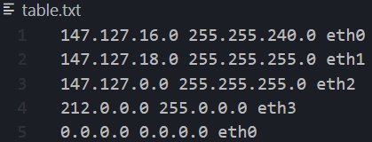
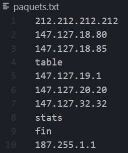
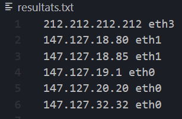
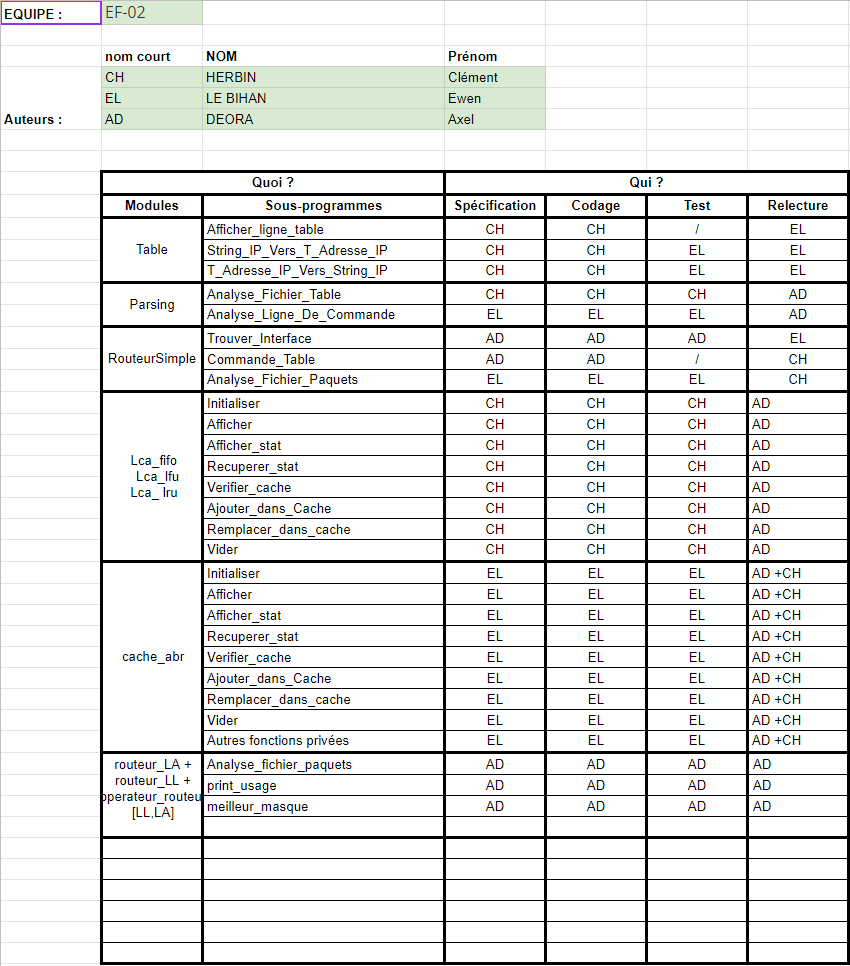

# PIM-PRO3-22

_Réalisé par:_

- HERBIN Clement
- LE BIHAN Ewen
- DEORA Axel

## Installation

Pour compiler le programme:

```bash
make routeur_la
make routeur_ll
```

Pour le lancer:
```bash
./routeur_ll
./routeur_la
```

_Les fichiers d'exemple ont les noms par défaut_

## Tests

Pour lancer les tests:

```bash
chmod +x test_all.sh
./test_all.sh
```

## Démarrage normal

### `./[routeur_ll | routeur_la] [options]`

### Options

### `-c <taille>`
Définir la taille du cache. <taille> est la taille du cache. La valeur 0 indique qu’il n y a pas de cache. La valeur par défaut est 10.

### `-p FIFO|LRU|LFU`
Définir la politique utilisée pour le cache (par défaut FIFO);

### `-s`
Afficher les statistiques (nombre de défauts de cache, nombre de demandes de route, taux de défaut de cache). C’est l’option activée par défaut.

### `-S`
Ne pas afficher les statistiques.

### `-t <fichier>`
Définir le nom du fichier contenant les routes de la table de routage. Par défaut, on utilise le fichier table.txt.

### `-p <fichier>`
Définir le nom du fichier contenant les paquets à router. Par défaut, on utilise le fichier paquets.txt.

### `-r <fichier>`
Définir le nom du fichier contenant les résultats (adresse IP destination du paquet et interface utilisée). Par défaut, on utilise le fichier resultats.txt

## Exemple

Nous avons 2 fichiers en entrée, **table.txt** et **paquets.txt**:  





Ensuite, nous lançons la commande:  
```bash
./routeur_ll -c 15 -t table.txt -p paquets.txt -r resultats.txt -P FIFO
```
On obtient en sortie:
```bash
table (ligne  4)
147.127.16.0 255.255.240.0 eth0
147.127.18.0 255.255.255.0 eth1
147.127.0.0 255.255.255.0 eth2
212.0.0.0 255.0.0.0 eth3
0.0.0.0 0.0.0.0 eth0
stats (ligne  8)
Défauts:           6 sur           6 (        100%)
fin (ligne  9)
```

Et le programme génère le fichier **resultats.txt** suivant:  

  

## Répartition du travail

